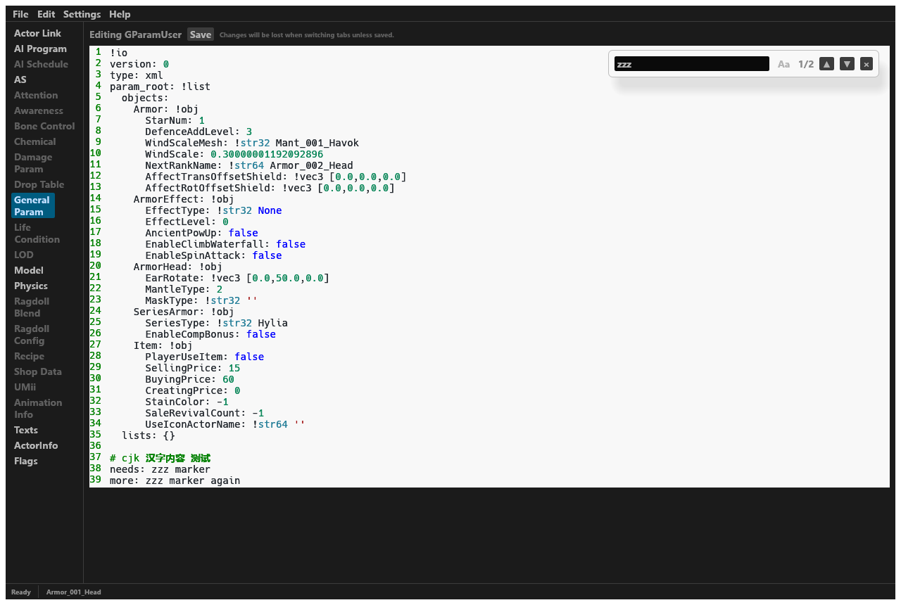

# BotW Actor Tool (Rust + egui)

A modern Rust rewrite of the original Python
[botw_actor_tool](https://github.com/GingerAvalanche/botw_actor_tool) for
_*The Legend of Zelda: Breath of the Wild*_. It edits actor packs
(`.sbactorpack`): load vanilla/mod actors, edit the Actor Link, every link
file as YAML (AAMP/BYML), Texts (MSBT), ActorInfo and GameData Flags — and on
save it regenerates `ActorInfo.product.sbyml`, the text files and the
GameData flags automatically.

## About

- **Repository**: [https://github.com/Alano6678/botw_actor_tool_rs](https://github.com/Alano6678/botw_actor_tool_rs)
- **Language**: Rust + egui (desktop GUI); every file format is handled by
  libraries ([roead](https://github.com/NiceneNerd/roead) / [msyt](https://github.com/NiceneNerd/msyt) / [msbt-rs](https://github.com/NiceneNerd/msbt-rs))
- **License**: AGPL-3.0-or-later
- **Status**: feature-faithful port of the original Python tool

## Screenshot



> Editing an actor's General Parameter file in dark mode, with the find bar
> open (matches highlighted in blue, the current one stronger) and the
> ActorInfo / Flags tabs available.

## Features

- Open vanilla actors from your game dump (`Ctrl+N`) or actors from a mod
  directory (`Ctrl+O`), including `TitleBG.pack`-resident actors and
  `*_Far` variants.
- **Actor Link** panel: actor name + Priority, every link as
  Dummy / ActorName / Custom, custom-link data import from vanilla, Tags.
- **YAML editor** for every link file (VS Code style: line numbers, syntax
  highlighting, accurate caret/click mapping) with a floating find bar
  (`Ctrl+F`, case-insensitive, match highlighting, n/m counter, next/prev,
  `Aa` case toggle).
- **Texts** tab: BaseName / Name / Desc / PictureBook per language.
- **ActorInfo** tab: previews every field the tool regenerates on save
  (auto value + source hint) with an override column and a "keep extra
  fields" option.
- **Flags** tab: lists the GameData flags (bool/s32) for the actor — edit
  values, add or delete flags, written back on save.
- **Localized UI**: English / 中文 (independent of the game text language).
- **Dark mode** with a complete theme and boosted text contrast.

## Tech (all formats handled by libraries)

| Format | Library |
| ---- | ---- |
| AAMP / BYML / SARC / Yaz0 | [roead](https://github.com/NiceneNerd/roead) 1.0 |
| MSBT (texts) | [msyt](https://github.com/NiceneNerd/msyt) 1.4 + [msbt-rs](https://github.com/NiceneNerd/msbt-rs) |
| GUI | [egui / eframe](https://github.com/emilk/egui) 0.36 |
| File dialogs | [rfd](https://crates.io/crates/rfd) |
| YAML code editor | [egui_code_editor](https://crates.io/crates/egui_code_editor) 0.4 |
| Data | `data/*.json` reused from the original tool (embedded at compile time) |

## Build & run

```bash
cargo run          # debug mode
cargo build --release && ./target/release/botw_actor_tool_rs.exe
cargo test         # unit tests (CRC32, flag round-trips, editor input)
```

Requires CMake + MSVC (roead's Yaz0 is a C++ FFI and builds zlib-ng via CMake).

## Usage

1. Open **Settings** first and set the Game / Update / DLC directories
   (unpacked ROM directories, same as the original tool).
2. `Ctrl+N`: pick a vanilla actor from the Update directory.
3. `Ctrl+O`: pick the mod's `content` or `romfs` directory, then an actor from
   `Actor/Pack`.
4. Left tabs: Actor Link (links / tags / name), YAML editors for each link
   file, Texts, ActorInfo, Flags.
5. `Ctrl+S`: pick the mod directory to save (the folder must be named
   `content` (big-endian / Wii U) or `romfs` (little-endian / Switch)).

## Source layout (src/)

```
main.rs       entry point (eframe)
app.rs        egui UI (main window / panels / dialogs)
actor.rs      BATActor orchestration (load / rename / save; port of actor.py)
actorinfo.rs  ActorInfo entry generation (port of actorinfo.py)
pack.rs       ActorPack: SARC/AAMP/BYML container (port of pack.py)
flag.rs       GameData flag model + overrides rules (port of flag.py)
store.rs      FlagStore (port of store.py)
texts.rs      MSBT text read/write via msyt (port of texts.py)
util.rs       constants, find_file, gamedata/savedata writing (port of util.py)
settings.rs   settings (JSON, %LOCALAPPDATA%\botw_actor_tool_rs\settings.json)
data.rs       static data loading (data/*.json, compile-time include_str!)
```

## Performance

- `[profile.dev]` uses `opt-level = 1` with dependencies at `opt-level = 2`
  (an unoptimized egui debug build is noticeably laggy; the first build is
  slower).
- The YAML editor uses `CodeEditor::show` which caches highlighting/layout by
  text hash — unchanged text is never re-laid out.
- Release build: `cargo build --release`.

## Tests

```bash
cargo test                    # unit tests (CRC32, flag round-trips, editor input)
cargo test real_dump -- --ignored --nocapture
# ignored tests read the real game dirs from settings.json, load several
# representative actors and verify Texts read Name/Desc/PictureBook correctly.
```

## Differences vs the original

- **Localized UI**: Settings → UI Language (English / 中文), independent of
  the game text language.
- **Code editor** uses egui_code_editor (VS Code style) with accurate
  caret/click mapping (a custom-layouter TextEdit had caret drift and broken
  deletion and was replaced).
- **Find bar**: `Ctrl+F` or Edit → Find, with match highlighting, Enter to
  jump, n/m counter and a case toggle.
- **Edit menu**: undo (Ctrl+Z) / redo (Ctrl+Y) / find (Ctrl+F).
- Editing font is a consistent 14 px monospace so the caret aligns with
  characters pixel-perfectly.
- A **"Saving Actor …"** modal is shown while saving; save/load errors surface
  as clear dialogs (the original silently swallowed them).
- Settings moved from INI to JSON; vanilla custom-file imports no longer ask
  before importing.
- The PyPI update check was removed.
- Not implemented (same as the original): the Elink/Profile/Slink/Xlink data
  files (the link values are editable in Actor Link; the resource files are
  global and not loaded), and AS animation / model / physics binary editing.

## License

GNU **AGPL-3.0-or-later** (same as the original; roead is GPL-3.0-or-later,
AGPLv3 is compatible).

---

# 中文说明

`botw_actor_tool_rs` 是原 Python 版 BotW Actor Tool
（[GingerAvalanche/botw_actor_tool](https://github.com/GingerAvalanche/botw_actor_tool)）
的 Rust 重写版，用于编辑《塞尔达传说：旷野之息》的 Actor（`.sbactorpack`）。
加载原始/Mod Actor、编辑 Actor Link、按 YAML 编辑各链接文件（AAMP/BYML）、
编辑 Texts（MSBT）、ActorInfo 与 GameData Flags；保存时自动重新生成
`ActorInfo.product.sbyml`、文本与 GameData 标志。

## 关于

- **仓库**：[https://github.com/Alano6678/botw_actor_tool_rs](https://github.com/Alano6678/botw_actor_tool_rs)
- **语言**：Rust + egui，所有文件格式均由库处理
  （[roead](https://github.com/NiceneNerd/roead) / [msyt](https://github.com/NiceneNerd/msyt) / [msbt-rs](https://github.com/NiceneNerd/msbt-rs)）
- **许可**：AGPL-3.0-or-later
- **状态**：原版 Python 工具的功能忠实移植版

## 截图


> 深色模式下编辑 actor 的通用参数文件，搜索条展开（匹配蓝色高亮、当前匹配更深），
> 并带有 ActorInfo / Flags 标签页。

## 功能

- `Ctrl+N` 从游戏解包目录打开原版 Actor；`Ctrl+O` 从 Mod 目录打开（含
  TitleBG.pack 内 resident actor 与 `*_Far` 变体）。
- **Actor Link** 页：Actor Name + Priority、每个链接（Dummy / ActorName /
  Custom 单选 + "Update Custom Link"）、自定义链接从原版文件导入、Tags。
- **YAML 编辑器**（VS Code 风格：行号、语法高亮、精确光标定位）+
  `Ctrl+F` 浮动搜索条（大小写不敏感、匹配高亮、Enter 跳转、n/m 计数、Aa 大小写切换）。
- **Texts** 页：BaseName / Name / Desc / PictureBook（按语言）。
- **ActorInfo** 页：预览保存时会重新生成的字段（自动值 + 来源说明），带
  覆盖列与"保留额外字段"选项。
- **Flags** 页：列出该 actor 的 GameData 标志（bool/s32），可改值、新增、
  删除，保存时写回。
- **中英文本地化**：设置 → UI Language（English / 中文），与游戏文本语言独立。
- **深色模式**：完整主题 + 提升的文字对比度。

## 技术选型（格式全部使用库）

| 格式 | 库 |
| ---- | ---- |
| AAMP / BYML / SARC / Yaz0 | [roead](https://github.com/NiceneNerd/roead) 1.0 |
| MSBT（文本） | [msyt](https://github.com/NiceneNerd/msyt) 1.4 + [msbt-rs](https://github.com/NiceneNerd/msbt-rs) |
| GUI | [egui / eframe](https://github.com/emilk/egui) 0.36 |
| 文件对话框 | [rfd](https://crates.io/crates/rfd) |
| YAML 代码编辑器 | [egui_code_editor](https://crates.io/crates/egui_code_editor) 0.4 |
| 数据 | `data/*.json` 直接沿用原版工具的数据（编译期嵌入） |

## 构建与运行

```bash
cargo run          # 调试模式
cargo build --release && ./target/release/botw_actor_tool_rs.exe
cargo test         # 单元测试（CRC32、Flag 往返）
```

需要 CMake + MSVC（roead 的 Yaz0 是 C++ FFI，会自动用 CMake 编译 zlib-ng）。

## 使用

1. 打开 **Settings**，设置 Game / Update / DLC 目录（纯文本 ROM 解包目录，
   与原版相同）。
2. `Ctrl+N`：从 Update 目录选择原始 Actor 打开。
3. `Ctrl+O`：选择 Mod 的 `content` 或 `romfs` 目录，从其 `Actor/Pack` 选择 Actor 打开。
4. 左侧标签页：Actor Link（链接/标签/名称）、各链接文件的 YAML 编辑器、
   Texts、ActorInfo、Flags。
5. `Ctrl+S`：选择 Mod 目录保存（目录名必须是 `content`（大端/Wii U）或
   `romfs`（小端/Switch））。

## 目录结构（src/）

```
main.rs      入口（eframe 启动）
app.rs       egui 界面（主窗口/面板/对话框）
actor.rs     BATActor 编排（加载/重命名/保存，Port of actor.py）
actorinfo.rs ActorInfo 条目生成（Port of actorinfo.py）
pack.rs      ActorPack：SARC/AAMP/BYML 容器（Port of pack.py）
flag.rs      GameData 标志模型 + overrides 规则（Port of flag.py）
store.rs     FlagStore（Port of store.py）
texts.rs     MSBT 文本读写（使用 msyt，Port of texts.py）
util.rs      常量、find_file、gamedata/savedata 写入（Port of util.py）
settings.rs  设置（JSON，%LOCALAPPDATA%\botw_actor_tool_rs\settings.json）
data.rs      静态数据加载（data/*.json，编译期 include_str!）
```

## 性能

- `[profile.dev]` 开启 `opt-level = 1`、依赖包 `opt-level = 2`
  （egui 未优化的 debug 构建会明显卡顿；首次构建时间会变长）。
- YAML 编辑器只用 egui_code_editor 的 `CodeEditor::show`（内部按文本哈希缓存高亮
  与布局），未更改的文本不会重复排版。
- 发布版：`cargo build --release`。

## 测试

```bash
cargo test                    # 单元测试（CRC32、Flag 往返、MSBT/SARC 往返、编辑器输入）
cargo test real_dump -- --ignored --nocapture
# 上面的 ignored 测试会读取 settings.json 里的真实游戏目录，
# 加载若干代表 actor 验证 Texts 能正确读到 Name/Desc/PictureBook。
```

## 与原版的差异

- **中英文本地化**：设置 → UI Language（English / 中文），与游戏文本语言独立。
- **代码编辑器**使用 egui_code_editor（VS Code 风格）：行号、YAML 语法高亮、
  点击/光标定位准确（自定义 layouter 的 TextEdit 存在光标错位与删除问题，已弃用）。
- **搜索/查找**：`Ctrl+F` 或 Edit → Find，匹配高亮、Enter 跳转、n/m 计数、Aa 大小写切换。
- **Edit 菜单**：撤回（Ctrl+Z）/ 前进（Ctrl+Y）/ 查找（Ctrl+F）。
- 代码/编辑字体统一为 14px 等宽字体，保证光标与字符像素级对齐。
- 保存 Actor 时显示 **"Saving Actor …"** 模态提示；错误会弹出明确的提示
  （原版静默吞掉）。
- Settings 从 INI 改为 JSON；导入 vanilla 自定义文件时不再弹窗询问而是直接导入。
- 移除了原版的 PyPI 更新检查。
- 未实现（与原版一致）：Elink/Profile/Slink/Xlink 数据文件（链接值可在 Actor
  Link 中修改，资源文件为全局共享且不加载）、以及 AS 动画 / 模型 / 物理二进制编辑。

## License

GNU **AGPL-3.0-or-later**（与原版一致；依赖 roead 为 GPL-3.0-or-later，
AGPLv3 与其兼容）。
